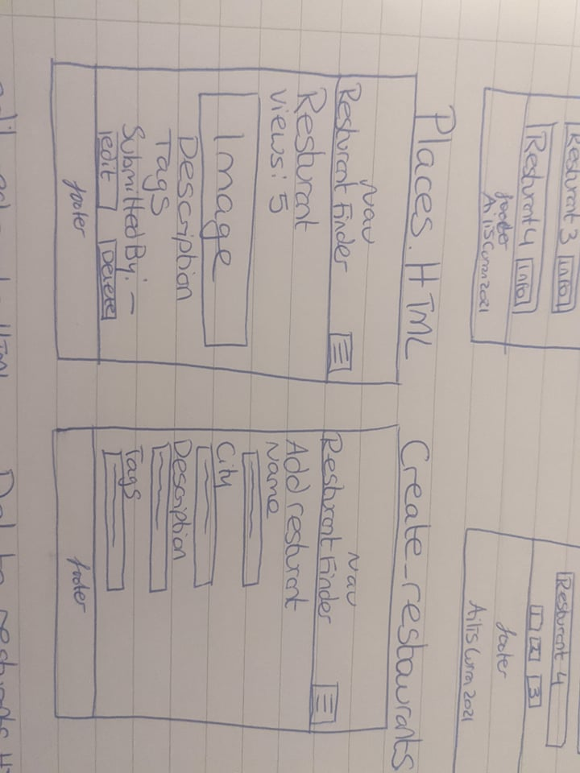

# Milestone Project 3

- - - - - - - - - - - - - - - - - - - - - - - - - - - - - - - - - - - - 
## Table of Contents
* [Purpose](#Purpose)
* [User Experience Design (UX)](#User-Experience-Design)
  * [User stories](#User-Stories)
    * [First Time Visitor Goals](#First-Time-Visitor-Goals)
    * [Returning Visitor Goals](#Returning-Visitor-Goals)
    * [Frequent User Goals](#Frequent-User-Goals)
  * [The Scope Plane](#The-Scope-Plane)
  * [Structure](#Structure)
  * [Design](#Design)
    * [Colour Scheme](#Colour-Scheme)
    * [Typography](#Typography)
    * [Wireframes](#Wireframes)
    * [Database Design](#Database-Design)
    * [Security](#Security)
* [Limitations](#Limitations)
- [Features](#Features)
    * [Existing Features](#Existing-Features)
    * [Future Features](#Features-Left-to-Implement)
* [Technologies](#Technologies)
* [Testing](#Testing)
    * [Test Strategy](#Test-Strategy)
    * [Test Results](#Test-Results)
* [Deployment](#Deployment)
    * [Project Creation](#Project-Creation)
    * [GitHub Pages](#Using-Github-Pages)
    * [Locally](Run-Locally)
    * [GitHub Pages](#Deployment-To-Heroku)
* [Credits](#Credits)
  * [Content](#Content)
  * [Acknowledgements](#Acknowledgements)
  * [Comments](#Comments)

## Purpose
This website was created for Milestone Project 3 in the Software Development Course for Code Insitute. The languages used in the project are the languages which have been thought in the course up until now, which include, HTML, CSS, JS, User Centric Design, Interactive Front End Development, Python Essential and Backend Development.

The live website can be found [here](https://ailisc97.github.io/Project_Milestone_3/) and on Heroku [here](https://resturant-places.herokuapp.com/home)

## Resturant Finder Website

Resturant Finder, is a website in which users can find a resturant by serching by location or tags, which is how to describe the resturant for example: cheap, spicy, Italian and expensive. Users can also have accounts where they can add, delete and edit resturants. This website is great for friends, family and couples who dont know where they want to eat and now they can easily find out where they want to go with this handy new website. This project is for the Milestone 3 project which has python and backend tecnology added in the form of MongoDB and Heroku. 

- - - - - - - - - - - - - - - - - - - - - - - - - - - - - - - - - - - - 
## User Experience Design

### User stories
#### First Time Visitor Goals
* As a First Time user,I want to easily and quickly navigate the website to look up resturants.
* As a First Time user, I want to easily and quickly navigate serch by tags to find a resturant.
* As a First Time user, I want to easily and quickly navigate serch by location to find a resturant.
* As a First Time user, I want to access the site links.

#### Returning Visitor Goals
* As a Returning User, I want to know who are the creators of this website.
* As a Returning user, I want to set up an account so I can add resturant(s) to the website.

#### Frequent Visitor Goals
* As a Frequent user, I want to set up an account so I can remove resturant(s) to the website.
* As a Frequent user, I want to set up an account so I can edit resturant(s) to the website.

### **The Scope Plane**

**Features planned:**
* Responsive design.
* Website title and information on the site purpose.
* Navigation Menu (Site Wide).
* MongoDB databases to store event information and user login/profile information.
* CRUD Functionality
* Login functionality.
* Logout functionality.
* Place Page to view each restaurant.
* Top four restaurants displayed and all restaurants are searchable to all users.
* Registered user restaurant creation, edit and delete management.

### Structure
All Pages will have a Navigation bar (using Bootstrap) at the top of the Webpage that allows the User to select resturants and to search different resturants.
The purpose of this is to fulfill user story:
> As a First Time user,I want to easily and quickly navigate the website to look up resturants.

The search function for the User to search different resturants.
> As a First Time user, I want to easily and quickly navigate serch by tags to find a resturant.
> As a First Time user, I want to easily and quickly navigate serch by location to find a resturant.

In the Footer there will be links to find the site links on the page.
> As a First Time user, I want to access the site links.

The Footer will also inform the user who are the website creators.
>As a Returning User, I want to know who are the creators of this website.

Users who set up an account would want to add, delete and edit the page so the other users can find new and exciting resturants to visit in the future.
>As a Returning user, I want to set up an account so I can add resturant(s) to the website.
>As a Frequent user, I want to set up an account so I can remove resturant(s) to the website.
>As a Frequent user, I want to set up an account so I can edit resturant(s) to the website.

### Design
#### Colour Scheme
The background colour used is white. The nav bar and the footer are a grey in colour. The resturant card has the background in white, the words in black and a picture of the resturant.

In the form page (signup.html), and the login page (login.html) the create restaurants (create_restaurant.html) and the edit restaurant (edit_restaurant.html) the form it's self is a white with black and a user friendly button.

The search bar is on the home page (index.html) and the resturant page (restaurants.html) there is a nice blue button to serch the restaurants,tags or city.

####  Typography
The font on the website is **Roboto**. This font was off Google Fonts.

#### Wireframes
Index.html page and Resturant Page Desktop 
 

Place page and Create_resturant page Desktop 
 

Edit_resturant page and Delete_restaurant page Desktop 
 

Login and Sign In Desktop 
 

Index.html page and Resturant Page Phone 
 

Place page and Create_resturant page Phone 
 

Edit_resturant page and Delete_restaurant page Phone 
 

Login and Sign In Phone 
 

- - - - - - - - - - - - - - - - - - - - - - - - - - - - - - - - - - - - 
#### Database Design
MongoDB Object format examples:

**food: places** 
{ 
&nbsp;&nbsp;&nbsp;&nbsp;_id: unique-value, 
&nbsp;&nbsp;&nbsp;&nbsp;name: "Spicy Sals" 
&nbsp;&nbsp;&nbsp;&nbsp;city: "Dublin" 
&nbsp;&nbsp;&nbsp;&nbsp;website: "http://google.com" 
&nbsp;&nbsp;&nbsp;&nbsp;phone: "555-555-555" 
&nbsp;&nbsp;&nbsp;&nbsp;tags: "spicy,cheap,clean,indian" 
&nbsp;&nbsp;&nbsp;&nbsp;added_by: "ailis" 
&nbsp;&nbsp;&nbsp;&nbsp;description: "Good restaurant, opened in 2013, best curry I've had!!" 
&nbsp;&nbsp;&nbsp;&nbsp;image: "https://static.standard.co.uk/s3fs-public/thumbnails/image/2019/11/25/..." 
&nbsp;&nbsp;&nbsp;&nbsp;view: 3 
}

**food: users** 
{ 
&nbsp;&nbsp;&nbsp;&nbsp;_id: unique-value, 
&nbsp;&nbsp;&nbsp;&nbsp;username: "freddie", 
&nbsp;&nbsp;&nbsp;&nbsp;password : "pbkdf2:sha256:150000$n6CiZywA$f5f4da0914672f1b47a63e0ef052473b62423ecb...", 
&nbsp;&nbsp;&nbsp;&nbsp;name : "fred bloggs", 
}

#### Security

Database connection details are set up in an env.py for development, for 
security reasons this is not uploaded to GitHub so that database and connection details are not visible to 
users. In production these are stored in Heroku. 
- - - - - - - - - - - - - - - - - - - - - - - - - - - - - - - - - - - - 

### Limitations
The biggest limitation I faced was the cards in the html that holds the resturants, they take any picture but sometimes the pictures are different sizes and I couldnt get them to be uniform. Its the same problem with the description some sentences are longer on some reviews then others, making the cards not uniform. 

City doesnt come up in some of the cards, or in some of the places.html. If I had more time id like to know why.
 

- - - - - - - - - - - - - - - - - - - - - - - - - - - - - - - - - - - - 

## Features
 
### Existing Features
The Nav bar, footer and form were all from Bootstrap.

### Features Left to Implement
As mentioned in the limitations having the cards all a uniform size would be a very nice touch.

## Technologies
  
* HTML
	* This project uses HTML as the main language used for the Website.
* CSS
	* This project uses CSS to style the Website.
* JavaScript
    * This project uses JS to have the game being able to function and the sendEmail which sends me an email when someone clicks  submit on the form.
* Python
	* This project uses CSS to connect to the background.
    * Python Modules used (These can be found in the requirements.txt project file):
     * dnspython==2.0.0
        * bcrypt==3.2.0
        *bson==0.5.10
        *click==8.0.1
        *dnspython==1.16.0
        *Flask==2.0.1
        *Flask-PyMongo==2.3.0
        *Flask-WTF==0.15.1
        *gunicorn==20.1.0
        *itsdangerous==2.0.1
        *pymongo==3.12.0
        *Werkzeug==2.0.1
        *WTForms==2.3.3
* [Mongo DB](https://getbootstrap.com/)
	* Mongo DB stored the infromation given from the website, and saved as a database.
* [Heroku](https://dashboard.heroku.com/)
	* Heroku is used for the deployment of the website.
* [Bootstrap](https://getbootstrap.com/)
	* The Bootstrap framework is used for Navigation bar, the carousel and the contact us form.
* [Google Fonts](https://fonts.google.com/)
	* Google fonts are used throughout the project to import the *Roboto* font.
* [GitPod](https://www.gitpod.io/)
    *GitPod is used to develop the website and where the code for the website was wrote.
* [GitHub](https://github.com/)
	* GitHub is the site used to store the code for the Website and [Git Pages](https://pages.github.com/) is used for the deployment of the live site.
* [Git](https://git-scm.com/)
	* Git is used as software to commit and push code to the GitHub repository where the source code is stored.
* [Google Chrome Developer Tools](https://developers.google.com/web/tools/chrome-devtools)
	* Google chromes built in developer tools are used to inspect page elements in various different sized. It also helped debug issues and test different CSS styles.
* [Techsini](http://techsini.com/multi-mockup/index.php)
    * tecnisih.com Multi Device Website Mockup Generator was used to create the Mock up image in this README
* [HTML Checker](https://validator.w3.org/nu/)
    * HTML Checker is an important website to make sure there are no errors in the HTML code.
* [W3 CSS Validator](https://jigsaw.w3.org/css-validator/validator)
    * CSS Checker is an important website to make sure there are no errors in the CSS code.
* [JSHint](https://jshint.com/)
    * JS Checker is an important website to make sure there are no errors in the JS code.
* [Python syntax checker](http://pep8online.com/)
    * Python Checker is an important website to make sure there are no errors in the JS code.
- - - - - - - - - - - - - - - - - - - - - - - - - - - - - - - - - - - - 
## Testing

### Test Strategy
#### **Summary**
Testing is required on all features and user stories documented in this README. 
All clickable links must redirect to the correct pages. All forms linked to MongoDB
must be tested to ensure they insert all given fields into the correct collections.

HTML Code must pass through the [W3C HTML Validator](https://validator.w3.org/#validate_by_uri).

CSS Code must pass through the [W3C CSS Validator](https://jigsaw.w3.org/css-validator/).

JavaScript code must pass through the [JSHint Validator](https://jshint.com/).

Python Code must pass through [PEP8 Validator](http://pep8online.com/)

All Code passed through the validator.

#### **High Level Test Cases**

#### **Access Requirements**
Tester must have access to MongoDB in order to manually verify the insertion 
of records to users and events collections.

#### **Regression Testing**
All features previous tested during development in a local environment must be regression 
tested in production on the live website.

#### **Assumptions and Dependencies**
Testing is dependent on the website being deployed live on Heroku.

### Test Results

Full test results can be found [here](static/images/TestCases.xlsx)

****

- - - - - - - - - - - - - - - - - - - - - - - - - - - - - - - - - - - - 
## Deployment

### Project Creation
To create this project I used the CI Gitpod Full Template by navigating 
[here](https://github.com/Code-Institute-Org/gitpod-full-template) and clicking the 'Use this template' button.

I was then directed to the create new repository from template page and entered in my desired repo name, then 
clicked Create repository from template button.

Once created, I navigated to my new repository on GitHub and clicked the Gitpod button which built my workspace.

* git add . -This would add all the work from the different pages to the GitHub.
* git add index.html -Would only save the work from Index.html
* git pull - This would pull the GitHub version of my project.
* git commit -m "MESSAGE" - This would commit the added work from git add . and leave a message beside it.
* git push- This pushed the added work to GitHub
* python3 -m http.server - This opened the website on the right hand side of the page.

### Using Github Pages
1. On the GitHub [Repository:](https://github.com/ailisc97/Project_Milestone_3)
1. Click the 'Settings' Tab on the right hand side.
1. Click on options.
1. Scroll Down to the Git Hub Pages Heading.
1. Select 'main' as the source.
1. Click the Save button.
1. Click on the link to go to the deployed page

### Run Locally
**Note: The project will not run locally with database connections unless the user sets up an [env.py](https://pypi.org/project/env.py/) file configuring IP, PORT, 
MONGO_URI, MONGO_DBNAME and SECRET_KEY. You must have the connection details in order to do this. These details are private and not disclosed in this repository 
for security purposes.**
1. On the GitHub [Repository:](https://github.com/ailisc97/Project_Milestone_3)
1. Click on the download code button, you will get options to clone the GitHub Repository or Download the Zip file.
1. If you downloaded the zip file open the file using one of your IDE application.
1. Or if you choice to clone the GitHub Repository, then open up a terminal and get to a directory of your choice then type in "git clone" followed by the GitHub Repository URL.
1. The clone will be created on your loacal machine. 

Once the project has been loaded into an IDE of choice, run the following command in the shell to install all the required packages:
> pip install -r requirements.txt

URL to deployed Heroku [here](https://resturant-places.herokuapp.com/home)

### Deployment to Heroku

**Create application:**
1. Navigate to Heroku.com and login.
1. Click on the new button.
1. Select create new app.
1. Enter the app name.
1. Select region.

**Set up connection to Github Repository:**

1. Click the deploy tab and select GitHub - Connect to GitHub.
1. A prompt to find a github repository to connect to will then be displayed.
1. Enter the repository name for the project and click search.
1. Once the repo has been found, click the connect button.

**Set environment variables:**

Click the settings tab and then click the Reveal Config Vars button and add the following:

1. key: IP, value: 0.0.0.0
2. key: PORT, value: 5000
3. key: MONGO_DBNAME, value: (database name you want to connect to)
4. key: MONGO_URI, value: (mongo uri - This can be found in MongoDB by going to clusters > connect > connect to your application and substituting the password and 
    dbname that you set up in the link).
5. key: SECRET_KEY, value: (This is a custom secret key set up for configuration to keep client-side sessions secure).

**Enable automatic deployment:**
1. Click the Deploy tab
1. In the Automatic deploys section, choose the branch you want to deploy from then click Enable Automation Deploys.

- - - - - - - - - - - - - - - - - - - - - - - - - - - - - - - - - - - - 
## Credits

### Code
Code for the Navigation bar and the footer was taken from [Bootstrap](https://getbootstrap.com/).

I took insperation from the mini project which was completed with the college.  

### Content
Content was created by Ailis Curran.

### Acknowledgements
I would like to thank my mentor Spencer Barriball for all his help throughout the project.

### Comments
README.md insperation was taken from my previous Milestone Project. It gave me a template to complete my README, all README content is my own.